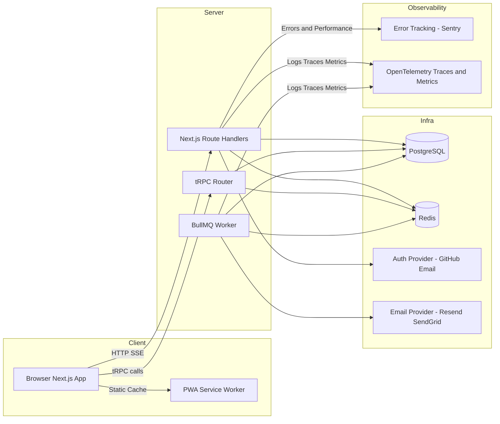

# CollabSpace – Full-Stack Project Specification

## 1. Overview

**CollabSpace** is a modern, full-stack project and task collaboration platform inspired by tools like Linear and Trello. It is designed as a portfolio-grade application that demonstrates end-to-end full-stack skills using the JavaScript/TypeScript ecosystem.

**Primary goals:**

- Provide a realistic, production-style web application to show in interviews.
- Deliberately practice and showcase modern full-stack skills.
- Be “CV-ready”: live demo, clean architecture, solid documentation.

**Target users:**

- Small software teams
- Product managers and developers needing a lightweight but powerful task and collaboration hub.

---

## 2. Technology Stack

### 2.1 Frontend

- **Design System:** See [@docs/design-system.md](./design-system.md) for color palette, typography, and layouts.
- **Framework:** Next.js 16+ with App Router and React Server Components
- **Language:** TypeScript (strict mode)
- **Styling:** Tailwind CSS
- **UI components:** shadcn/ui (headless primitives styled with Tailwind)
- **State management:**
  - React hooks for local state
  - React Hook Form + Zod for complex forms
  - TanStack Query for server state (caching, optimistic updates)
- **Data fetching & streaming:**
  - Server Components + Suspense for streaming and loading UI

### 2.2 Backend & API

- **API layer:** tRPC (end-to-end type safety)
- **Runtime:** Node.js via Next.js server
- **Authentication:** Better Auth
  - Credentials (email + password)
  - GitHub OAuth
  - **Multi-tenancy:** Better Auth Organizations plugin for Workspace management.

### 2.3 Data, Background Jobs, and Real-Time

- **Database:** PostgreSQL
- **ORM:** Drizzle ORM (with `postgres.js` driver)
- **Caching & queue:** Redis
- **Background jobs:** BullMQ (worker process)
- **Real-time:** Server-Sent Events (SSE) using Next.js route handlers (for live updates)

### 2.4 Offline-First & PWA

- **PWA:** manifest.json, service worker, offline UI
- **Offline support:**
  - Service worker for asset caching and runtime caching strategies
  - Basic offline UI and fallback
- **Implementation:** plain service worker + Cache API (Serwist optional)

### 2.5 Observability & Monitoring

- **Error tracking:** Sentry for Next.js
- **Observability:** OpenTelemetry instrumentation for traces and metrics
- **Logging:** structured JSON logs correlated with traces

### 2.6 Testing

- **E2E:** Playwright
- **Unit & integration:** Vitest / Jest (TS)
- **Testing libraries:** React Testing Library for component tests

### 2.7 DevOps & Deployment

- **Monorepo:** Turborepo
- **CI:** GitHub Actions
  - lint
  - type check
  - unit + integration tests
  - build (Next.js)
- CD:
  - Frontend/Backend: Vercel
  - Database & Redis: managed service (e.g., Railway, Render, Neon, Supabase)
  - Worker: deployed as a long-running Containerized Service (Docker) - _Cannot be Serverless_.

### 2.8 Local Development

- **Containerization:** Docker Compose for local infrastructure (PostgreSQL, Redis).
- **Data Seeding:** Automated script (`npm run db:seed`) to populate the database with dummy workspaces, users, and tasks for immediate testing.
- **Ease of Use:** Single command setup (`docker-compose up` + `npm run dev`) to demonstrate focus on Developer Experience (DX).

### 2.9 Security & Quality

- **Configuration:** Type-safe environment variables (`@t3-oss/env-nextjs`) to prevent runtime crashes.
- **Validation:** Shared Zod schemas for client/server input validation (tRPC + REST).
- **Rate Limiting:** Upstash Ratelimit or equivalent for public API and Auth routes.
- **Headers:** Security headers (Helmet, CSP) configured for the Next.js app.

---

## 3. High-Level Architecture

---

## 4. Feature Phases

The project is divided into two major phases:

- **MVP:** Essential features that already make a strong full-stack statement.
- **Polish & Differentiators:** The “missing pieces” (offline-first, real-time, testing pyramid, observability, REST surface, extra polish).

---

## 5. Phase 1 – MVP (Must-Have)

**Goal:** Build a cohesive, usable SaaS-style task collaboration app that demonstrates:

- Modern React, TypeScript, Next.js App Router, Suspense
- tRPC for type-safe API design
- Relational data modeling with PostgreSQL and Drizzle ORM
- Authentication & authorization
- Background job processing (emails)
- Basic CI/CD and deployment
- **Testing Infrastructure:** Vitest (Unit/Integration) and Playwright (E2E) setup from day one.
- **Core Testing:** High-ROI integration tests for tRPC procedures and unit tests for critical business logic.

### 5.1 Authentication & Authorization

**Features:**

- Sign up with email + password (hashed in DB).
- Login with email + password.
- Login with GitHub OAuth.
- Session management via Better Auth (database-backed).
- Workspace membership (via Organizations plugin):
  - Users belong to workspaces.
  - Roles: owner, admin, member.
  - Authorization middleware:
    - Only workspace members can view its data.
    - Only Owners/Admins can invite/remove members or change roles.

**Tech / implementation:**

- Better Auth configuration with Credentials and GitHub providers.
- `@better-auth/organizations` plugin for multi-tenancy.
- Drizzle schemas generated/mapped for Better Auth requirements.
- tRPC middleware for `isWorkspaceMember` / `isWorkspaceOwner`.

### 5.2 Workspace & Organization

**Features:**

- Create workspace with name and slug.
- Switch between workspaces.
- Invite members to a workspace:
  - Invite stored in DB with a token.
  - Email sent with invite link.
  - Accepting invite creates Member record.

**Tech / implementation:**

- Better Auth Organizations plugin API for CRUD and Invitations.
- Background job: BullMQ sends invite emails (triggered by Better Auth hooks or custom logic).
- Invite acceptance flow: Better Auth built-in invitation routes.

### 5.3 Boards, Columns, and Tasks (Kanban)

**Features:**

- Create boards within a workspace (Organization).
- Columns: default Todo / In Progress / Done (customizable later).
- Tasks:
  - title, description, priority, labels, due date, assignee.
  - position ordering within columns.
- Drag-and-drop tasks between columns.
- Optimistic UI updates for task moves and edits.

**Tech / implementation:**

- Drizzle schemas: Board, Column, Task. `Board` is linked to Better Auth `Organization`.
- tRPC procedures for CRUD and reorder operations.
- Drag-and-drop using dnd-kit or similar.
- TanStack Query for client state and optimistic updates.

### 5.4 Basic Collaboration

**Features:**

- Comments on tasks:
  - Threaded per task.
  - Show author, timestamp, and content.
- Activity feed:
  - Per board: shows “Task moved”, “Task assigned”, “Comment added”, etc.
  - Polled on navigation or on a timer (e.g., every 30–60s) – in MVP, real-time is optional (see Phase 2).

**Tech / implementation:**

- Models: Comment, ActivityLog.
- ActivityLog entries created server-side after mutations.
- Simple periodic polling or fetch-on-focus for updates in MVP.

### 5.5 Background Jobs & Email Notifications

**Features:**

- Emails sent on:
  - Workspace (Organization) invite sent.
  - Task assigned to user.
  - Due date approaching (simple scheduled job).
- Job retries on failure.
- Logging of job status.

**Tech / implementation:**

- BullMQ producer enqueues jobs to Redis.
- Invite emails are triggered by Better Auth's built-in invitation events/hooks.
- Worker app (in Turborepo) consumes jobs and sends emails via Resend/SendGrid.
- Jobs defined as TypeScript interfaces with Zod schemas.
- Logs for job start, success, failure, retry.

### 5.6 Time Tracking (Basic)

**Features:**

- Start/stop timer on a task.
- View list of time entries filtered by task/user/date.
- No fancy dashboards yet – just raw data and simple totals.

**Tech / implementation:**

- Model: TimeEntry (taskId, userId, start, end, duration).
- Timer component in UI storing start time locally and sending start/stop calls via tRPC.
- Simple API to query entries by user or task.

### 5.7 CI/CD & Deployment (MVP Level)

**Features:**

- GitHub Actions workflow:
  - lint
  - type check
  - unit tests (if any)
  - build (Next.js)
- Deployment:
  - Vercel for app.
  - Managed Postgres + Redis for data.

**Tech / implementation:**

- GitHub Actions workflow with separate jobs.
- Environment variables in Vercel and hosting provider.
- DB migrations via Drizzle Kit (run in deploy script or CI).

### 5.8 Testing Pyramid – Core Coverage (MVP)

**Features:**

- **Infrastructure:** Vitest and Playwright configured in the monorepo.
- **Unit Tests:** Core utilities and pure business logic (e.g., permission helper functions).
- **Integration Tests:** tRPC procedures tested with a real test database (Postgres) and transaction rollbacks.
- **E2E Tests:** Critical flows covered by Playwright:
  - Sign up / log in.
  - Create workspace (Organization) & board.
  - Move a task between columns (Drag-and-drop).
  - Invite user flow (DB state verification).

**Tech / implementation:**

- Vitest for unit/integration.
- Playwright for E2E.
- Test database environment with Drizzle migrations.
- Page object model for maintainable E2E tests.

### 5.9 Logging & Basic Observability (MVP Level)

**Features:**

- Structured logging (JSON) on both app and worker.
- Request ID attached to logs where possible.
- Central error tracking with Sentry (client + server).

**Tech / implementation:**

- Log library (e.g., pino or console with structured format).
- Sentry SDK for Next.js initialized.
- Basic dashboard checks: errors are being captured and grouped.

---

## 6. Phase 2 – Polish & Differentiators

**Goal:** Extend MVP to fully cover “missing” advanced skills and stand out from typical portfolio projects:

- Real-time communication (SSE)
- Offline-first PWA
- Testing pyramid (unit + integration + E2E)
- Observability (OpenTelemetry traces & metrics)
- REST API surface (alongside tRPC)
- Advanced UX, performance, and DX

### 6.1 Real-Time Communication with SSE

**Features:**

- Live updates per board:
  - Task moved / created / updated
  - New comments
- Activity feed updates in near real-time.
- Connection status indicator (“Live”, “Reconnecting”, “Offline”).

**Why SSE:**

- Simple HTTP-based, built-in browser API.
- Well-suited for server-to-client streaming updates.
- Easier to integrate with Next.js route handlers than WebSockets for many use cases.

**Tech / implementation:**

- Next.js route handler `/api/boards/[id]/events` returning an SSE stream.
- On relevant mutations, push events to:
  - Redis pub-sub channel per board.
  - Route handler subscribes to Redis channel and forwards to clients via SSE.
- Client:
  - EventSource or lightweight wrapper for SSE.
  - Merge incoming events into TanStack Query cache or local state.
- Robustness:
  - Auto-reconnect with backoff.
  - Event versioning / IDs to support replay/resume if desired.

### 6.2 Offline-First PWA

**Features:**

- PWA installable as an app (manifest, icons).
- Core app shell and assets cached via service worker.
- Offline viewing:
  - Recently viewed boards/tasks visible offline.
  - Offline banner / modal explaining state.
- Mutation queue (Scope Constrained):
  - Optimistic UI updates for immediate feedback.
  - Simple "queue and retry" mechanism (Last-Write-Wins strategy).
  - _Note:_ Complex conflict resolution (CRDTs) is explicitly out of scope for this portfolio project to maintain focus on core features.
  - Queue mutations in IndexedDB/local storage when offline.
  - Sync mutations when back online (best effort).

**Tech / implementation:**

- PWA manifest with name, icons, start URL, theme colors.
- Service worker:
  - Cache assets and app shell (static JS/CSS) on install.
  - Runtime caching:
    - Static assets: cache-first.
    - API routes: network-first, with stale-while-revalidate strategy where appropriate.
  - Simple offline fallback HTML page or UI.
- Offline detection:
  - Listen to online/offline events.
  - Optionally use a health-check endpoint to confirm connectivity.
- Mutation queue:
  - Lightweight client queue storing tRPC calls to replay.
  - On reconnect, flush queue; handle errors and conflicts gracefully.

### 6.3 Extended Testing & Edge Cases

**Features:**

- **Enhanced E2E:**
  - Real-time updates (multi-window sync verification).
  - Offline behavior (simulate offline, perform action, verify sync on reconnect).
- **Complex Integration:**
  - BullMQ job processing tests with real Redis/Worker interaction.
  - Conflict resolution scenarios for "Best Effort" offline sync.
- **Visual Regression:** Snapshot testing for critical UI components (Optional).
- **Performance Testing:** Basic Lighthouse or custom scripts for critical path latency.

**Tech / implementation:**

- Playwright network interception for offline simulation.
- Redis-mock or ephemeral Redis containers for worker tests.
- Merge coverage reports across Vitest and Playwright.

### 6.4 Observability with OpenTelemetry

**Features:**

- Traces:
  - End-to-end traces from client request to server and DB/background job.
- Metrics:
  - HTTP request latency and error rates.
  - Background job processing duration and failure rates.
- Logging:
  - Structured logs linked to trace IDs for correlation.

**Tech / implementation:**

- OpenTelemetry instrumentation for Next.js.
- Exporters to a backend (e.g., Highlight, Jaeger, or any OTel-compatible backend).
- Custom spans around key operations:
  - tRPC procedure calls.
  - BullMQ job processing.
  - External calls (email provider).
- Ensure Sentry errors include trace context where possible.

### 6.5 REST API Surface (alongside tRPC)

**Features:**

- A small, well-documented public REST API:
  - GET /api/public/organizations/:id/boards
  - GET /api/public/boards/:id/tasks
  - Optional: webhook-style event stream for external integrations.
- Authentication via Bearer token (API key per Organization).

**Purpose:**

- Show you can design classic REST endpoints alongside a modern tRPC internal API.
- Demonstrate API versioning and security thinking.

**Tech / implementation:**

- Next.js route handlers (not tRPC) for REST endpoints.
- Zod schemas reused from tRPC where possible.
- API keys stored in DB (hashed).
- Rate limiting and logging on REST routes.

### 6.6 Advanced UI & UX Polish

**Features:**

- Advanced board features:
  - Swimlanes or more complex views (if time permits).
  - Custom labels and priorities.
- Richer collaboration:
  - Markdown support in task descriptions and comments.
  - Mention suggestions (@username).
- Performance:
  - Pagination for tasks, comments, activity logs.
  - Skeleton loaders, transitions, and micro-interactions.
- Accessibility:
  - Keyboard navigation support.
  - Focus states, ARIA labels.

**Tech / implementation:**

- Markdown renderer (e.g., react-markdown).
- Mention parsing with simple regex or small parser.
- Server-driven pagination with cursor or offset.
- Tailwind for animations and transitions.

### 6.7 Documentation & “Case Study” Write-Up

**Features:**

- High-quality README:
  - Live demo link.
  - Clear tech stack list.
  - Architecture overview (with Mermaid diagram).
  - “Why I built this” and “What I learned.”
- Architecture Decision Records (ADRs):
  - Log of major technical decisions (e.g., `docs/adr/001-why-sse.md`) to document the engineering thought process over time.
- Architecture / design decisions doc:
  - Why tRPC over pure REST/GraphQL for internal API.
  - Why SSE vs WebSockets for real-time.
  - Why chosen PWA and caching strategies.
  - Trade-offs and what you’d do differently in production.

**Tech / implementation:**

- SPEC.md / ARCHITECTURE.md in the repo.
- Code comments for complex parts (SSE handler, worker, auth middleware).
- Optionally a short blog-style write-up.

---

## 7. Skills Coverage Summary

By the time CollabSpace is complete with both MVP and Phase 2, it should explicitly cover:

- **Modern React (hooks, suspense, App Router):** Next.js App Router, Server Components, Suspense, streaming.
- **TypeScript across the stack:** TS in frontend, backend, shared types; tRPC + Drizzle ORM.
- **API design (REST or GraphQL):** tRPC for internal, plus small public REST API.
- **Relational data modeling (PostgreSQL):** Rich schema with organizations, boards, tasks, time entries, invites, activity logs.
- **Authentication & authorization:** Better Auth, session management, organization membership and roles.
- **Real-time communication:** SSE for live board and activity updates.
- **Background job processing:** BullMQ + Redis worker for emails, scheduled tasks.
- **Offline-first design:** PWA with service worker, caching strategies, offline UI, mutation queue.
- **Testing strategies (unit → integration → e2e):** Vitest/Jest for unit/integration, Playwright for E2E.
- **CI/CD and deployment:** GitHub Actions, Vercel, managed DB/Redis.
- **Observability (logging, metrics, error tracking):** Structured logging, Sentry, OpenTelemetry traces & metrics.
